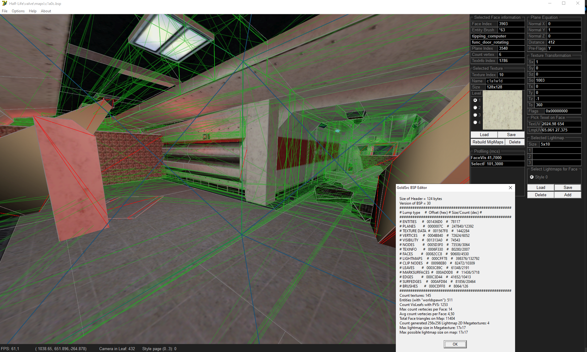

# This program created for edit GldSrc BSP. 
- Lightmap Editor (import/export per Face for each style 0..3)
- Texture Editor (import/export for each mipmap, mass Export to WAD3, mass import from WAD3)

Minimal requirements: OpenGL 1.3+; CPU Pentium 4 x86 (SSE + SSE2) + FPU x87; ~32MB RAM; ~32MB GPU RAM; Win 2000 or great;
LICENSE of this project in [thirdpartylegalnotices.txt](https://github.com/Sergey-KoRJiK/GldSrcBSPditor/blob/master/LICENSES/thirdpartylegalnotices.txt) and [Half Life 1 SDK LICENSE](https://github.com/Sergey-KoRJiK/GldSrcBSPditor/blob/master/LICENSES/LICENSE%20HALF-LIFE%20SDK.txt)

